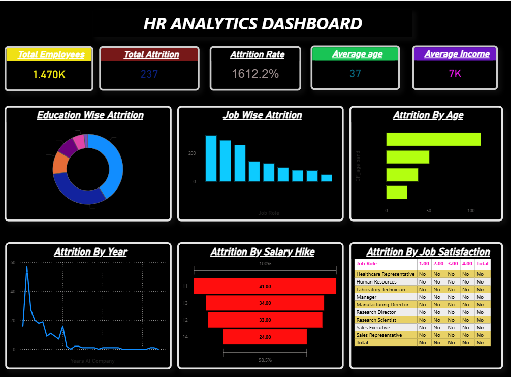

# HR Analytics Dashboard (Power BI)

This project presents an interactive HR Analytics dashboard built using Power BI to analyze employee data and workforce trends.

## Key Insights

• Employee attrition analysis
• Job satisfaction and employee performance trends
• Salary hike impact on employee retention
• Department-wise employee distribution

## Tools Used

• Power BI
• Data Cleaning
• Data Visualization

## Dashboard Preview

This dashboard helps organizations understand workforce patterns, improve employee retention, and make data-driven HR decisions.
